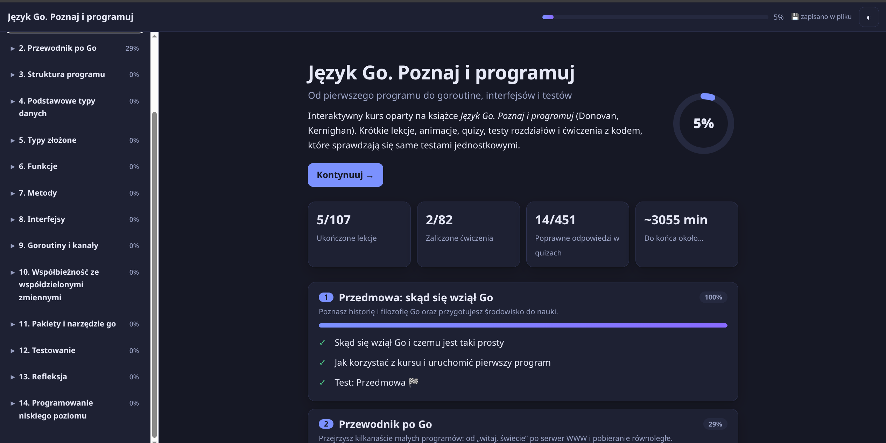
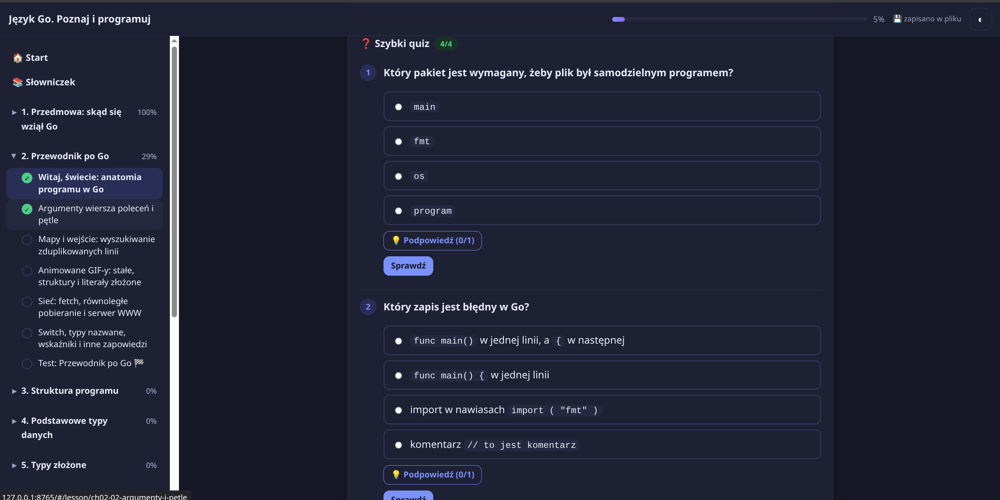
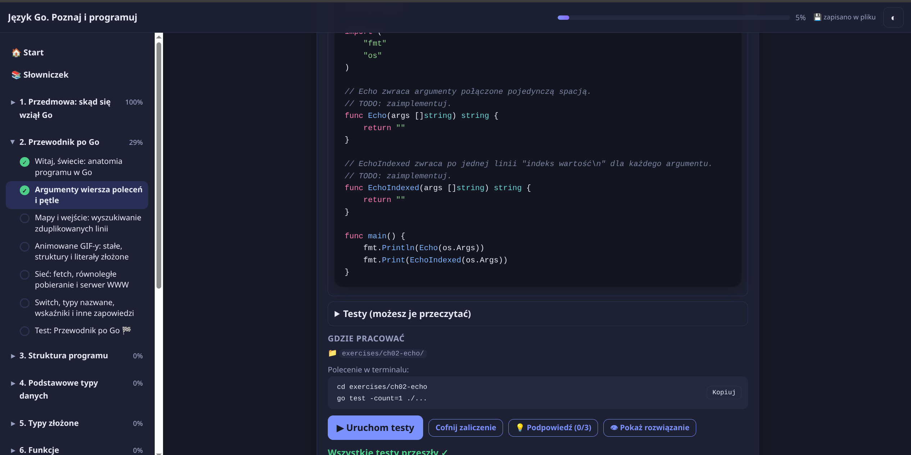

# book-to-course

Turn a book into an interactive course you can run locally in a browser. This Claude skill uses the source material to build beginner-friendly lessons, then adds ways to practise and check what you have learned. It accepts EPUB, PDF, HTML, DOCX, Markdown, and plain text.

## What a course can include

- Short lessons with step-by-step explanations, worked examples, diagrams, and animated walkthroughs.
- Interactive quizzes with hints and explanations, chapter tests, and flashcards.
- Programming exercises with starter code, examples, and unit tests. Learners write code in their editor, run the tests from the course page, and see whether their solution passes.
- Progress tracking for lessons, quiz answers, and exercises, saved locally so learners can pick up where they left off.

For coding exercises, the skill checks that the tests fail on the starter code and pass on a reference solution before packaging the course. When a book does not call for code, the course can use other practice activities, such as self-check exercises.

## Example course

These screenshots show a course generated from a Go programming book:

### Course overview and progress

### Interactive quiz

### Coding exercise and test results

## How it works

1. Give the skill a book or document and ask it to create a course. You can specify the course language and scope.
2. The skill extracts the source, plans lessons by chapter, and builds the course as a folder of local web files.
3. Open the generated course with `start.sh` (macOS/Linux) or `start.bat` (Windows). The local server saves progress to `progress/progress.json` and lets the **Run tests** button execute the exercise's test command on your computer.

Starting the course this way requires Python 3. Programming exercises also require the relevant language and test tools, such as Go for a Go course. You can open `index.html` directly without the server; quizzes and lessons still work, while progress stays in the browser and code tests must be run in a terminal.

The skill and its supporting scripts, templates, and references are in [`book-to-course/`](book-to-course/SKILL.md). Generated courses are self-contained folders that can be packaged and shared.
